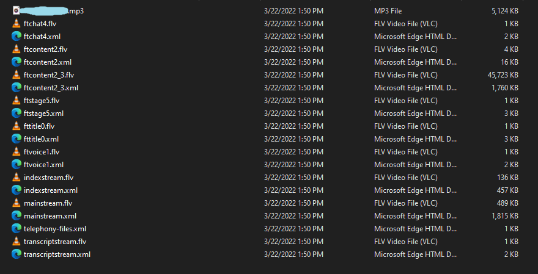
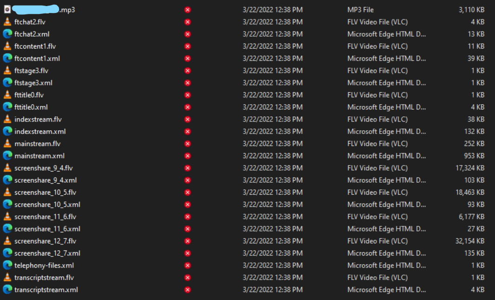

# flvToMP4.py

Covert your old adobe connect streams to mp4.<br>
Videos can be watched using VLC, for some reason the Windows player won't play them correctly.<br>
<br>
DISCLAIMER: This is a messy, non-ideal code project. Maybe it might help someone.<br>
<br>
Requirements: ffmpeg, accessible via command line (add to path)<br>
Tested on Win 11, ffmpeg win64-gpl-5.0 <br>
<br>

You can download adobe connect sessions as zip, unpack them and pass the resulting folder to the python instance.<br>
<br>
Works for streams which look like this unpacked (ftcontent files):<br>

<br>
or this (screenshare files)<br>

<br>
<br>
Gaps between different screenshares are filled with stillimage_placeholder.png
<br><br>
Example
<br><br>
```
from classes.KTVIDEO import KTVIDEO

TEMP_FOLDER = r'C:\Users\Max\ffmpeg_temp' # working area
srcfolder = r'C:\Users\Max\extractedzipfolder'
destfilepath = r'C:\Users\Max\video.mp4'

ktvideo = KTVIDEO(TEMP_FOLDER)
ktvideo.create_fullvideo_from_folder(srcfolder,destfilepath)
```

<br>
If this does not work for you:<br>
the general approach is to look at the .flv and .xml files which come in pairs.<br>
You can figure out the correct time for each video by their xml start datetime, and their duration (last <message time='milliseconds'> tag).<br>
For the audio you can find out the start datetime by looking at mainstream.xml, somewhere in there '.mp3' is referenced.